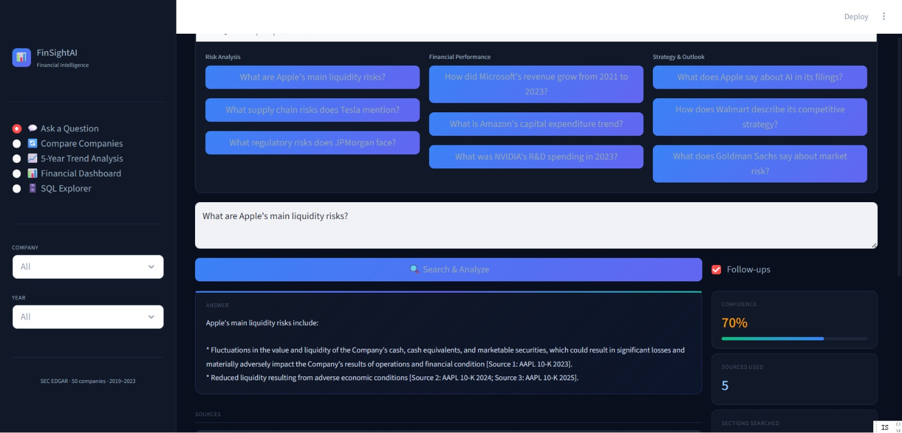

# User Guide

This guide explains how to run and use the SEC EDGAR Analytics System via the Streamlit UI.

---

# 1. System Overview

FinSightAI is an end-to-end financial intelligence system that combines:

- SEC EDGAR data extraction
- Structured financial analytics
- Risk classification
- Multi-year trend analysis
- RAG-powered question answering (Gemini LLM)

The system is accessed through a Streamlit-based UI.

---

# 2. Launch the Application

## Step 1: Activate Environment

```bash
.venv\Scripts\activate
```

## Step 2: Run UI

```bash
streamlit run app.py
```

---

# 3. UI Overview
## Main Interface



The UI consists of four main areas:

### 3.1 Sidebar (Left Panel)

Controls filtering and navigation:

- Ask a Question → RAG + LLM QA
- Compare Companies → cross-company analysis
- 5-Year Trend Analysis → time-series insights
- Financial Dashboard → structured metrics
- SQL Explorer → direct database queries

Filters:

- Company selector
- Year selector

### 3.2 Query Panel (Center Top)

Users can:

Type custom questions
Click suggested prompts (e.g. liquidity risk, revenue growth)

Examples:

What are Apple's main liquidity risks?
How did Microsoft’s revenue grow from 2021 to 2023?

### 3.3 Answer Panel (Center Bottom)

Displays:

- Structured answer
- Bullet-point explanation
- Source citations (10-K filings)

Example output includes:

- Extracted risk factors
- Financial insights
- Supporting filing references

### 3.4 Insight Panel (Right Side)

Shows metadata:

- Confidence score
- Sources used
- Sections searched

This helps evaluate answer reliability.

---

# 4. Important: Data Dependency

The UI does NOT compute everything in real time.

It depends on precomputed outputs from the analytics pipeline.

If UI Shows Missing Data

Run:

```bash
python -m src.run_analytics_pipeline all
```

This generates:

- financial metrics
- risk classifications
- comparison outputs
- trend analysis

## Data setup (from scratch)

If you are running this project for the first time, you need to download and process SEC EDGAR data before using the UI.

Download SEC ED
Run the data pipeline:

```bash
python -m src.run_data_pipeline
```
This step will:

Fetch filings from SEC EDGAR
Extract raw filing documents
Process and clean the data
Generate structured data

### Important: SEC EDGAR Access Requirement

Before running the data pipeline, you MUST set your email:

SEC_EDGAR_EMAIL=your_email@example.com

This is required because:

SEC requires a valid user identity
Requests without identification may be blocked
Ensures compliance with SEC fair access policy
3.3 Output of Data Pipeline

After running successfully, you should see:

```
data/
├── raw/                      # raw filings
├── dataset/
│   ├── edgar_chunks.jsonl
│   ├── edgar_docs.jsonl
│   ├── financial_metrics.jsonl
```

# 5. Core Features

## 5.1 Question Answering (QA)

Ask natural language questions about SEC filings.

Powered by:

- RAG (retrieval system)
- Gemini LLM

## 5.2 Company Comparison

Compare companies on:

- Text base
- Revenue

## 5.3 Risk Analysis

Displays:

- Extracted risk categories
- Evidence from filings

## 5.4 Trend Analysis

Analyzes:

- Multi-year revenue trends
- Earnings changes
- Financial strategy evolution

---

# 6. Supporting Pipelines
### 6.1 Analytics Pipeline (Required)
```bash
python -m src.run_analytics_pipeline all
```

Pipeline flow:

```
extraction → risk → compare → trend
```

## 6.2 RAG Pipeline (Recommended for QA)

```bash
python -m src.run_rag_pipeline all
```

Builds:

embeddings
FAISS index

## 6.3 SQL Database
```bash
python -m src.sql_database
```

Creates:

data/sql/finsightai.db

---

# 7. Configuration
Gemini API Key (Required)

Used for:

QA
Risk classification
GEMINI_API_KEY=your_api_key

Get it from:
https://ai.google.dev/

SEC EDGAR Email (Required)

Required for SEC access:

SEC_EDGAR_EMAIL=your_email@example.com

Purpose:

Identify requests
Avoid rate limiting/blocking
Comply with SEC policy

---

# 8. Troubleshooting
UI shows empty results

Fix:

python -m src.run_analytics_pipeline all
QA not responding

Check:

GEMINI_API_KEY set
RAG index built:
python -m src.run_rag_pipeline all
Strange financial values

Cause:

extraction / unit normalization issue

Check:

financial_extractor.py


# 9. Demo Workflow (Recommended)
## 1. Run analytics pipeline
## 2. Run RAG pipeline
## 3. Launch Streamlit UI
## 4. Demonstrate:
   - QA
   - Compare
   - Risk
   - Trend

# 10. Best Practices
Always run full pipeline before demo
Use consistent tickers (AAPL, MSFT, etc.)
Validate SQL outputs
Monitor logs for missing steps

# You're Ready 🚀

You now have a full-stack financial intelligence system combining:

SEC EDGAR data
Structured analytics
SQL database
RAG + LLM (Gemini)
Interactive Streamlit UI